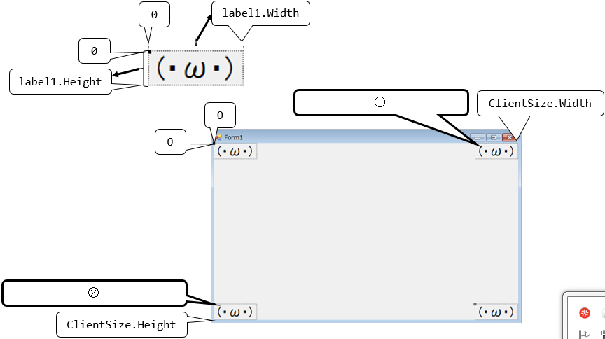

# ゲームプログラミング1年生
2017年度 デジタルアーツ東京 ゲームプログラミング１年生用リポジトリー

# 講義予定
- [シラバス](syllabus.md)

# 参考URL
- [GitHubにUnityのプロジェクトを新規に作成する手順(VisualStudioも同様)](http://am1tanaka.hatenablog.com/entry/2016/02/05/102508)
- [GitHub Desktopで.gitignoreが作られなかった場合の対処](http://am1tanaka.hatenablog.com/entry/2017/06/09/234448)

# 後期13回目(1/26)
## 話題
- [paiza作問責任者&人気企業とpizzaを食べながらもぐもぐ勉強会 #2](https://peatix.com/event/320026)
- [Unityライティングのチュートリアル](https://www.youtube.com/watch?v=VnG2gOKV9dw&feature=youtu.be)
- [Unity道場. 物理シミュレーションのスライド](https://twitter.com/nyaa_toraneko/status/956506148550488065)
- [Unity2018.1から導入されるShader Graphのサンプルライブラリー](https://github.com/UnityTechnologies/ShaderGraph_ExampleLibrary)

## 回転について
- 前回、かなり分かりづらくなってしまったので、改めてこちらに説明があります http://www.geisya.or.jp/~mwm48961/kou2/linear_image3.html
  - 前回やったのは、これの説明2ですね

## 今日の動画
- https://www.youtube.com/watch?v=fP300HM9NLw

## 予定
- Rigidbody続き RigidbodyRensyuを開く。ない場合は https://am1.jp/dat/RigidbodyRensyu180126.zip
  - [旋回型のプレイヤー操作 前進、後退](https://github.com/dat17/gp1/wiki/%E6%97%8B%E5%9B%9E%E5%9E%8B%E3%81%AE%E3%83%97%E3%83%AC%E3%82%A4%E3%83%A4%E3%83%BC%E6%93%8D%E4%BD%9C)
  - メモを残したい人は https://gist.github.com/tanakaedu/d6f166173abeb4c197757f56f3e28e65/raw/71ce8a6bc3326d774a59ee086572ab325848c907/TurningPlayerMakingMemo.md を自分のwikiなどへ
  - ジャンプの高さを変える
  - 上下左右で移動するプレイヤー
  - 高速移動時の対応
  - 練習問題
    - [CollisionRensyu](https://github.com/dat17/gp1/raw/master/CollisionRensyu.zip)をダウンロードして、Unityで開く。test1とtest2という2つのシーンがあり、それぞれに問題が表示されるので、指示通りに操作をして、解答せよ
    - test1とtest2が完成したら、保存をしてUnityを閉じて、指定のフォルダーにコピーして提出せよ
    - 指示に従ってGoogleドキュメントに貼り付けて共有せよ
- paizaの練習

# 後期12回目(1/19)
## 話題
- WebGLビルドが失敗した時の対処
  - Gzip圧縮でエラーが発生していたようです。とりあえずの対処は無圧縮でビルドしてください → http://am1tanaka.hatenablog.com/entry/2018/01/17/154649
- [Unity+MAYAウェビナーのメモ](https://twitter.com/am1tanaka/status/953857239286128640)
  - [Unity FBX Exporter](https://assetstore.unity.com/packages/essentials/fbx-exporter-beta-101408)
  - [iCrone](https://www.reallusion.com/store/product.html?l=4&p=ic)
  - [Alembic Importer](https://github.com/unity3d-jp/AlembicImporter)
  - [MASH. MAYAのプラグイン](https://knowledge.autodesk.com/ja/support/maya/learn-explore/caas/CloudHelp/cloudhelp/2016/JPN/Maya/files/GUID-5F45C398-D87D-424E-9F00-51D9FAB5A40B-htm.html)
- Asset Graph Tool
  - アセットバンドルをグラフィカルに構築するツール
  - 5.6には使えた少し古いツール
  - アセットバンドル以外の用途でも、一括してテクスチャーを変換したい場合などに使えるもよう
  - [テラシュールブログ. 【Unity】AssetGraphTool、ノーコーディングで 「指定フォルダにインポートしたアセットの設定を、指定した内容に自動更新する」 機能を作る](http://tsubakit1.hateblo.jp/entry/2018/01/11/233824)
  - [公式マニュアル](https://docs.google.com/document/d/1yTkHZch5EaDBCria6I3Xy5UtqrfFx8n9jU1WHre-w0U/edit#heading=h.v6lo8s3ttkod)

## 今日の動画
- https://www.youtube.com/watch?v=p0yaydFe6J4

## 内容
- Rigidbody続き RigidbodyRensyuを開く。ない場合は https://am1.jp/dat/RigidbodyRensyu180117.zip
  - [旋回型のプレイヤー操作](https://github.com/dat17/gp1/wiki/%E6%97%8B%E5%9B%9E%E5%9E%8B%E3%81%AE%E3%83%97%E3%83%AC%E3%82%A4%E3%83%A4%E3%83%BC%E6%93%8D%E4%BD%9C)

# 正月休み課題
- 1日程度で完成させることができる小作品を作って、ポートフォリオページで公開して、休み明けにプレゼンテーション
- 1週間ゲームジャム以降に作成したもの
- すでに現在開発中のものがあれば、それでよい
- 休み前に完成させておくと楽なので推奨

# 後期11回目(1/12)
## 話題
- [Unity1週間ゲームジャム Meetup in Tokyo #1 ](https://connpass.com/event/74062/?utm_campaign=event_message_to_selected_participant&utm_source=notifications&utm_medium=email&utm_content=text_detail_url)に行ってきます。そこで作品展示したいです
- [AREA JAPAN. Unity & Autodesk 最新ゲームパイプライン紹介ウェビナー～Maya 2018.1とUnity 2017.3でFBXファイル互換は一体どうなったのか？～](https://area.autodesk.jp/event/webinar/maya-unity-game-pipeline/)
- Unity2018.1の話題が出てきてかなり凄い感じなので、色々情報を仕入れましょう

## 内容
- WebGLビルドについて
  - WebGLビルドに失敗した場合、Unity Collaboにアップロードして、教卓PCのVR-PCでビルドします
- Unity2017.3のインストール
  - 2017.1.1は残さずに、上書きインストールでよい
  - AndroidとWebGLにチェック
  - Android SDKは、自分のところだけでよい  http://am1tanaka.hatenablog.com/entry/2016/04/05/230542#Android-SDK

# 後期10回目(12/22)
## 話題
- https://github.com/modesttree/Projeny がよさそう
  - Unityのパッケージマネージャー
  - Asset Storeでダウンロードしたパッケージを管理できる
  - プロジェクト間でアセットを共有できる
  - プロジェクトをパッケージ別にまとめて、依存関係で管理することができる
  - 英語情報しかないので使い方をまとめ中
- 水曜だけでできたものお披露目

## 今日の動画
- cinemachine https://www.youtube.com/watch?v=cdR8o5uiOVE

## 内容
- Physics https://docs.unity3d.com/ja/current/Manual/PhysicsOverview.html
  - [前回のプロジェクト RigidbodyRensyu](https://am1.jp/unity/RigidbodyRensyu171215.zip)
    - 斜面をうまく降りる

```cs
	void Update () {
        Vector3 motion = Vector3.zero;

        // 着地時
        if (chr.isGrounded)
        {
            velY = 0f;

            // ジャンプ
            //// 初速
            if (Input.GetButtonDown("Jump"))
            {
                velY = JUMP_POWER;
            }
        }
        else
        {
            // 上昇中断
            if (((chr.collisionFlags & CollisionFlags.Above) != 0) && (velY > 0f))
            {
                velY = 0f;
            }
        }
        lastGrounded = chr.isGrounded;

        // 重力落下をプログラム
        //// 今回のフレームでの重力加速
        velY += Physics.gravity.y * Time.deltaTime;
        //// 落下の設定
        motion.y = velY * Time.deltaTime;

        // 水平移動
        motion.z = Input.GetAxisRaw("Vertical")
            * SPEED * Time.deltaTime;

        // 着地時は、次の足場があるかチェック
        if (chr.isGrounded && (velY <= 0f))
        {
            // 足場チェック
            Vector3 next = transform.position + motion;
            RaycastHit hit;
            Vector3 p1 = next + chr.center + Vector3.up * -(chr.height * 0.5F-chr.radius);
            Vector3 p2 = p1 + Vector3.up * (chr.height - chr.radius * 2f);

            // 次の移動先から段差分下げて、地面に衝突するか
            if (Physics.CapsuleCast(
                p1,
                p2,
                chr.radius,
                -transform.up,
                out hit,
                chr.stepOffset))
            {
                // 段差分下げて、足場があれば、下げてよい
                motion.y -= chr.stepOffset;
            }
        }

        chr.Move(motion);
    }
```

- Cinemachine
- 正月作品の制作

# 後期9回目(12/15)
## 今日の動画
- https://www.youtube.com/watch?v=UEkxKx36kuQ
- 2コマ目 https://www.youtube.com/watch?v=11ycHdpDhDg

## 内容
- オブジェクト指向プログラミング：staticの次から [前回の完成プロジェクト](https://am1.jp/dat/object-practice-2016-01.zip)
- Physics https://docs.unity3d.com/ja/current/Manual/PhysicsOverview.html
  - [前回のプロジェクト](https://am1.jp/unity/RigidbodyRensyu171208.zip)
  - Character Controller
    - FPS動作の着地処理

## 時間があれば
- TextMesh Proのマテリアルの要素をAnimationさせる
  - 「textmesh pro material animator」で検索してみつけた http://digitalnativestudios.com/forum/index.php?topic=308.0 を参考に、変更したいプロパティーを追加することが可能

# 後期8回目(12/8)
## デスクトップ動画 2コマ目から
- https://www.youtube.com/watch?v=NCK8fZRSqB4

## 内容
- オブジェクト指向プログラミング
  - p4 非オブジェクト指向プロジェクト https://github.com/tanakaedu/object-practice-2016/archive/no-object.zip
  - p4 非オブジェクト指向プロジェクトGist https://gist.github.com/tanakaedu/a55477056822950e6ab59f16efc83dbb
  - p5 不要なコードを削除したもの https://gist.github.com/tanakaedu/f843c5744c770ed466824a62018a8821
- Physics https://docs.unity3d.com/ja/current/Manual/PhysicsOverview.html
  - Character Controller

# 後期7回目(12/1)
## 話題
- [@toRisouP. Unity開発で使える設計の話+Zenjectの紹介](https://www.slideshare.net/torisoup/unityzenject)
- [岩永信之. Unityで使える C# 6.0～と .NET 4.6](https://t.co/1YKRtDKJhV)
- [@YuukiOgino. Unity認定試験のスクリプト勉強範囲と個人的に感じている合格のメリットについて](https://qiita.com/YuukiOgino/items/2d00c5372f26c0bb35f2)

## 動画
- ポートフォリオをGitHub Pagesのアカウントページにアップロードする https://www.youtube.com/watch?v=L543qNQg_fE

## 内容
- [12/1～12/4 期間限定でpaizaのポートフォリオ制作講座が無料](https://paiza.jp/works/career/primer)
  - 全て動画に従って学習
  - GitHubにアカウントページを作成して、作成したポートフォリオのデータをアップロードする
- コルーチン

# 後期6回目(11/24)
## 話題
- [Y_YOSHINARI. Web出身のUnityエンジニアによる大規模ゲームの基盤設計](https://developers.cyberagent.co.jp/blog/archives/4262/)
- UniRxとZenject https://github.com/dat17/gp1/wiki/UniRx%E3%81%A8Zenject%E3%83%A1%E3%83%A2

## 内容
- GitHub LFSの利用
  - http://am1tanaka.hatenablog.com/entry/2017/11/22/190219
- Physics https://docs.unity3d.com/ja/current/Manual/PhysicsOverview.html
  - 準備
    - https://raw.githubusercontent.com/dat17/gp1/master/04/%E5%95%8F%E9%A1%8C2.txt を右クリックして新しいタブで開く
    - 全て選択してコピーしておく
    - Googleドライブを開く
    - 新規作成でドキュメントを作成
    - ドキュメント名を「1124<氏名>」のように設定(例：1124タナカ)
    - 先ほどコピーしたテキストを貼り付ける
    - 右上の[共有]をクリックして、 YRK00337@gmail.com を共有設定する
    - 講義を聞きながら、解答を入力していく
  - https://github.com/dat17/gp1/raw/master/RigidbodyRensyu.zip をダウンロードして開く
  - RigidbodyやColliderの基本を確認
  - Colliderの種類と衝突の組み合わせ

# 後期5回目(11/17)
## 動画
- [デスクトップ動画](https://www.youtube.com/watch?v=x0TiH28hfPU)

## 内容
- プロジェクトにUnityコラボとCloud Buildを設定
- WebGLでビルド
- ビルドが完了したら、UnityRoomに作品を仮投稿
- 不具合があれば直す
- UnityRoomのスクリーンショットについて(仮のものを作っておく)
  - http://am1tanaka.hatenablog.com/entry/2017/07/03/232748
  - [ScreenPresso. スクリーンショットや画面動画の撮影ツール](https://www.screenpresso.com/ja/)
    - Download > Download Screenpressボタン > メールアドレスを入力してDownload > 実行 > ユーザー個人でインストールしたらできたと思った
- 各自、作業

# 後期4回目(10/27)
## 動画
- [デスクトップ動画](https://www.youtube.com/watch?v=fVE5Od1Vf5I)

## 内容
- [RFC. MUST, MUST NOTなど、要求レベルを表すキーワード](http://www.ietf.org/rfc/rfc2119.txt)
- [Unity上で形状を作成できるアセット ProBuilder Basic](https://www.assetstore.unity3d.com/jp/#!/content/11919)
  - [ProBuilder Documentation](http://procore3d.github.io/probuilder2/)
  - [ゴマちゃんフロンティア 【Unity】「ProBuilder Basic」を使ったシンプルなステージ作成](http://gomafrontier.com/unity/625)
  - [テラシュールブログ 【Unity】ProBuilder Basicでコーネルボックスを作ってみる](http://tsubakit1.hateblo.jp/entry/2017/10/25/221216)
  - [コーネルボックス(cornell box)とは](https://www.graphics.cornell.edu/online/box/)
    - コーネル大学が提唱した物理ベースレンダリング(physically based rendering)を理解するための箱を配置したモデルのこと
- DATフェスタ進捗確認、作業

# 後期3回目(10/20)
## 動画
- [デスクトップ動画](https://www.youtube.com/watch?v=oBts5d-6pkY)

## 内容
- [講義メモ](https://github.com/dat17/gp1/wiki/UnityUI)
- TODOリストの確認。未作成の場合は、その場で話し合いながら作成
  - タイトルは作業内容を書く
  - 期限はマイルストンで設定
    - 「緊急」と「やった方がいい」は期日なしで使い回す
    - 「やるべきこと（必須）」は期日付きにする。期日だけでも良い
  - 作業担当者をAssignする
- バグを見つけたら
  - 以下を参考にラベルをつけて、Issuesに登録する
    - https://qiita.com/maeda_t/items/4344bdeabcc6a18a34cc
- UI https://docs.unity3d.com/ja/current/Manual/UICanvas.html
  - キャンバスのモードについて
  - Rect Transformツール
- DATフェスタ作業

# 後期2回目(10/13)
## 動画
- [デスクトップ動画](https://www.youtube.com/watch?v=JeREWqLGkIQ)

## 内容
- [講義メモ](https://github.com/dat17/gp1/wiki/day1013)
- Audio
  - Audio Clipの種類 https://docs.unity3d.com/ja/current/Manual/class-AudioClip.html
  - BGMの再生
  - SEの再生
  - 3Dサウンド
  - できたらAudio Mixer https://docs.unity3d.com/ja/current/Manual/AudioMixer.html
- DATフェスタ作業

# 後期1回目(10/6)
- Unity Analyticsの設定とイベントの設定(Clearとゲームオーバー)
  - 反映は1日後なので、とりあえず仕込んだ状態

## ゲームつくりの大枠
1. プロジェクトを作る
1. Unity Collaborateをメンバーで設定(デザイナーがいれば、デザイナーにもUnityライセンスを取らせて、登録して、使わせる)
1. 画面の解像度を決めて、Unityに設定する
    - プラットフォームは？
    - スマホなら、ターゲットの端末を決めて、その解像度を調べてそれにする
    - PCの場合、展示環境を調べて、そのモニターの解像度
1. できれば、この時点でシーンの切り替えを実装しておく
    - タイトル、ゲーム中、ゲームオーバー、クリアなどを実装して、切り替えられるようにする
    - ゲームオーバーになってから、新しくゲームを始めるとき、あるいは、ステージクリア時に正しくパラメータが初期化されたり、更新されるようにする
    - スコア、ステージ数、プレイヤーの残り数などを、ちゃんと管理する
1. 早めに完成のゲーム画面の雰囲気を整えておく
    - 背景、ライティング(光の設定)、画面効果、ユーザーインターフェースを、動かない状態でよいので、綺麗に仕上げてみる
    - 1日ぐらいかけて、早いうちに設定をしておくとよい
1. Unity Cloud Buildなど、実行ファイルを早めに作成して、動きを確認しておく

以上を仕込んでから作り始めるとよい。

### ポイント
- データのやり取りではなるべくUSBなどは使わない
- 早めに完成画面のイメージを掴む
- 早めにビルドしておく
- 同じものは複数作らず、プレハブ化する

---

# 15回目(9/15)
## 発表会
- 一人5分～10分程度
- 作品をネットドライブにコピーしておいて、教卓PCで実行して、解説
- 発表内容は以下の通り
  - 作品名
  - 作品の概要
  - 操作方法
  - ゲームのルール
  - どこを自分で開発したか
  - 利用したアセットやチュートリアルを、全て紹介
- 各内容については、 https://unityroom.com/ の作品を何本か確認して、どのように書けば分かりやすいかを研究して、工夫すること

### 発表の評価
以下の要領で、発表について評価をしてください。

- A2以下に、発表者の名前を入力
- 発表者の行のB列に、作品の出来について、大変よくできていたら3、よくできていたら2、普通なら1、ダメなら0
- 同様に、C列に、プレゼンの分かりやすさや聞きやすさについて、同じく3～0
- D列には、感想や、改良点、提案などを自由に入力

以下、注意のこと。

- B列とC列の点数は、3～1をバランスよく配分すること
- 点数とコメントは、誰が書いたかを伏せて発表者に伝える。コメントは、参考になりそうなアドバイスを書いて欲しい。自分のことは棚にあげることが大事

## リンク
- [naichi lab. WebGLビルド方法② CloudBuildの利用](http://blog.naichilab.com/entry/cloud-build-webgl)

## その後の予定
- WebGLビルド(できなければUnity Collaboで)
- Unity Collabo を使ったチーム開発
- Paizaスキルチェック
- GitHubの整備
  - Tyrano Scriptの背景を変更するまで
  - Visual C#で、ラベルを沢山表示して、画面を跳ね返らせて、速度を乱数で設定
  - Unityのyoketoru

# 14回目(9/8)
## モデル発表
- [蝉ファイナル](https://gitpitch.com/dat17/semi-final-slide)
  - [スライドの元データ](https://github.com/dat17/semi-final-slide/blob/master/PITCHME.md)
  - [蝉ファイナルを遊ぶ](https://unityroom.com/games/semi-final/webgl)

## 内容
- Unityのアップデート
- Googleワークシートで評価シートを作成して、講師に共有
- 発表準備
### 発表の評価
以下の要領で、発表について評価をしてください。

まずは準備。

- https://drive.google.com を開く
- Googleにログインしていなかったら、 Gmail アカウントでログイン
- 左上の[新規]ボタンを押す
- [Googleスプレッドシート]を選択
- 上の[無題のスプレッドシート]をクリックして、「発表評価0908苗字」に書き換える(苗字の部分は、自分の苗字に書き換え)
- B1に「作品点」と入力
- C1に「プレゼン点」と入力
- D1に「コメント」と入力
- 右上の[共有]をクリック
- 指示されたメールアドレスを入力して、[送信]を押す


## 発表しながらUnityをアップデート

現在のUnityをアンインストール。

- [スタート]メニュー > [コントロールパネル] > [プログラムと機能]を選択
- [Unity]を見つけて、右クリック > [アンインストールと変更]を選択
- [はい](or yes)をクリック
- [スタート]メニュー > すべてのプログラムを選んで、Unityの古いフォルダーが残っていたら、右クリックして削除する

[Microsoft Visual Studio 2015]があったら、同様にアンインストール。

Unityの最新版をインストールする。

- https://unity3d.com/jp/get-unity/update を開いて、Unity2017.1.1 のインストーラーをダウンロード
- インストーラーを起動
- [Next] > [I accept the・・・]にチェック > [Next]
- 以下にチェックが入っているのを確認。不要なチェックがあれば外す
  - Unity2017.1.1 f1
  - Standard Assets
  - Visual Studio 2017 Community・・・
  - Android Build Support
  - WebGL Build Support
- 以上、チェックを設定したら、[Next]
- そのまま、[Next]

インストールが完了するまで待つ(次のPCへ)

インストールが完了したら、以下を作業して、途中で管理者の要求が表示されたら[許可]をする

- Unityを起動する
- NEWプロジェクトを名前はそのままでよいので作成
- C# Scriptを作成
- 作成したスクリプトファイルをダブルクリックして、Visual Studioが起動するのを確認

以上できたら、起動したプログラムを全て閉じて、ログアウトして、GP12でログインしなおす。

以下、設定。

- Unityを起動
- 先ほど作成した New Unity Project をLOAD
- [Edit] > [Preferences...]を選択
- 左から[External Tools]を選択
- [External Script Editor]を[Browse...]に設定
- 以下のパスを設定
  - C:\Program Files (x86)\Microsoft Visual Studio\2017\Community\Common7\IDE\devenv.exe
- JDK 欄の[Browse]をクリック
- パスが自動的に設定されるので、[フォルダーを選択]をクリック
- [Layout]を[2 by 3]に
- [Project]ビューの右上のハンバーガーメニュー(三)をクリックして、[One Column]を選択

以上で完了。

# 13回目(7/21)
- [今回(13回目)の講義の動画目次](./docs/13-live.md)
- [前回(12回目)の講義の動画目次](./docs/12-live.md)
- 前回の金曜日欠席の人
  - https://github.com/dat17/yoketoru を開く
  - 右の[Clone or Download]ボタンをクリックして、[Download ZIP]をクリックしてダウンロード
  - ダウンロードが完了したら、ファイルを開く
  - スタートメニューから、コンピュータを開いて、[ライブラリ]>[ドキュメント]>[パブリックのドキュメント]>[Unity17]フォルダーを開いておく
  - フォルダーが開くので、[yoketoru-master]フォルダーをドラッグして、上で開いた[Unity17]フォルダーにドロップしてコピー

## 今日の提出
- \\LANDISK-A601\disk\2017年\学生用フォルダー\GP_1\gameprograming13 フォルダー内に、半角英数で、苗字のフォルダーを作って、その中に、キャラクターの差し替えと、BGM/SEが入ったUnityのプロジェクトフォルダーをコピーして提出
- 以上が完了したら、夏休みの課題の作業を開始する
  - yoketoruに新しい要素を入れる or 別のプロジェクトを探す or オリジナルの企画を考える etc...

## 内容：よけとる開発仕上げ
- [今回のデスクトップ動画のライブ配信](https://www.youtube.com/watch?v=nZip5_dVoTI)
- キャラクタープレハブの作成
- AssetStoreで、キャラクターと背景をインポート
  - プレイヤー
  - アイテム
  - 敵
  - 背景
- BGMと効果音の再生
  - 鳴らすタイミング
    - タイトル画面でスタートした時の効果音
    - ゲーム中のBGM。ループ再生する
    - アイテムを取ったときの効果音
    - 敵にぶつかった時の効果音
    - ゲームオーバージングル
    - クリア曲
    - タイトルは無音
  - 手順
    - リソースを探す
    - 著作者名とURLをGitHubのREADME.mdに書く
    - 再生方法をWebで検索して、実装する
## フリー素材音楽サイト
- [魔法魂](http://maoudamashii.jokersounds.com/)
- [効果音ラボ](http://soundeffect-lab.info/)
- [甘茶の音楽工房](http://amachamusic.chagasi.com/)
- [PANICPUMPKIN ファミコン風オリジナル音楽](http://pansound.com/panicpumpkin/)

## 参考プロジェクト
- [Unityの簡易シーン切り替え例2017年度版](https://github.com/tanakaedu/SimpleScene17)

## メモ
- プレイヤーのアセット
  - https://www.assetstore.unity3d.com/jp/#!/content/18880
- アイテムのアセット
  - https://www.assetstore.unity3d.com/jp/#!/content/73764
- 敵のアセット
  - http://u3d.as/F02
- 背景のアセット
  - https://www.assetstore.unity3d.com/jp/#!/content/18880

## 夏休みの課題：ミニゲームの開発
Unity、Phaser、その他の環境でも可。<b>ミニ</b>ゲームを開発する。

- 完全なオリジナルでなくてもよい
  - 講義で作成したyoketoruを改造したもの
  - Webで見つけたチュートリアルを改造したもの
  - AssetStoreのプロジェクトを改造したもの
  - 書籍のサンプルを改造したもの
- yoketoruの場合、以下のような要素を追加してみよう
  - 障害物を作る
  - 弾を撃つ
  - 敵の動きのバリエーションを増やす
  - 演出(パーティクル)
  - 画面を綺麗にする
- チュートリアルの例
  - ひよこのたまご http://hiyotama.hatenablog.com/
  - Unityの公式 https://unity3d.com/jp/learn/tutorials
  - AssetStore https://www.assetstore.unity3d.com/jp/#!/search/page=1/sortby=popularity/query=price:0&category:98
  - 本棚の書籍

### 夏休み明け
夏休み明けに、以下の要領で発表会を行う。

- 一人5分～10分程度で発表
- 作品をネットドライブにコピーしておいて、教卓PCで実行して、解説
- 発表内容は以下の通り
  - 作品名
  - 作品の概要
  - 操作方法
  - ゲームのルール
  - どこを自分で開発したか
  - 利用したアセットやチュートリアルを、全て紹介
- 各内容については、 https://unityroom.com/ の作品を何本か確認して、どのように書けば分かりやすいかを研究して、工夫すること


## 以下、水曜日に実施済み
- [暗くなるのを解決する](./docs/13-shiage.md)
- ゲームオーバー、クリア時に処理を止める
- ボールや敵の出現を、`Spawner`オブジェクトにする(`Awake`にする必要がなくなる)


---

## 前回の修正
- MoveBall.cs の `Start`の処理は、`Awake`にした方がよい
  - ゲームオブジェクトのインスタンシエイトを実行してから、`Start`が動くまでに時間差があり、その間に当たり判定が動いてしまうと、不測の事態になる
  - そこで、インスタンシエイト直後に呼び出される`Awake`に座標の設定を変更することで、このような不具合を防ぐ
  - ただ、今回、出現処理を変更するため上記の不具合は自然に解消する


# 12回目(7/14)
- [前回(11回目)の講義の動画目次](./docs/11-live.md)

## 話題
- [Unity3D Japan 【Unite 2017 Tokyo】Unityで楽しむノンフォトリアルな絵づくり講座：トゥーンシェーダー・マニアクス](https://www.youtube.com/watch?v=6aNB9LhSx7g)
- [【第13回】東ゲ部もくもく会](https://togebu.doorkeeper.jp/events/62478)
  - 2017-07-16（日）10:30 - 18:00
  - 1,000円 会場払い
  - 申込締切 7月16日 17:00
- ゲーム業界の声

## 内容：よけとる開発(2)
- [今回のデスクトップ動画のライブ配信](https://www.youtube.com/watch?v=LahKaump9pQ)
- スコアの実装
- hanekaeri から移植

# 11回目(7/7)
- [前回(10回目)の講義の動画目次](./docs/10-live.md)

## 内容：よけとる開発(1)
- [今回のデスクトップ動画のライブ配信](https://www.youtube.com/watch?v=fx5Tohe7FyI)
- 新しいUnityプロジェクトを作成
- GitHubに登録
- [状態遷移についてスライド](docs/unity-scene-1706.pptx)
- [状態遷移を作る](docs/10-scene.md)
- プレイヤー用のアセットを読み込む

# 10回目(6/30)
## 9回目の内容
- [成果物](https://github.com/tanakaedu/move-labels/)
- [前回(9回目)の講義の動画目次](./docs/09-live.md)

## 内容
- [今日のデスクトップ動画](https://www.youtube.com/watch?v=XTjNKwH1hvs)
- 前回やったことの復習
- Unityの乱数
- ボールの数を数える(static)
- マウス移動
- ベクトルについて
- 移動速度に上限を設定
- キャラクターを見分ける(Tag)

# 9回目(6/23)
## 8回目にやったこと
- [1コマ目 C#](https://www.youtube.com/embed/kkYjFjGVsdY)
  - C# 違う変数型への代入方法
  - switch文
  - マウス入力
  - オフセットとピボット
  - コミットとSync
  - ifその2。複合で当たり判定
- [2コマ目 Unity](https://www.youtube.com/embed/E3OvAjHDvso)
  - 同じプレハブから作成したオブジェクトの共通の振る舞いを設定するには、プレハブで作業する
  - OnMouseEnter()を使う
  - Debug.Logで表示
  - Destory()でオブジェクトの削除
  - SetActive()で有効・無効の切り替え
  - 文字表示
  - ゲームマネージャー
  - 空のゲームオブジェクト(Empty)
  - Inspectorで、Hierarchyのオブジェクトを渡す方法
    - public変数
  - 物理エンジンの時間を止める

## 内容
- [今日のライブストリーミング](https://www.youtube.com/embed/ZpBuUYDRLMg)
- 乱数
- for文
- 配列
- 以上、[成果物](https://github.com/tanakaedu/move-labels/)

# 8回目
## 7回目にUnityでやったこと
- [2017/6/9 GP1-8 Unityでボールを画面内で跳ね返らせる](https://www.youtube.com/embed/lVaOYDGzNk8?cc_load_policy=1&fs=1&rel=0&autoplay=1)
- [2017/6/9 GP1-8 Unityの描画のオンオフ](https://www.youtube.com/embed/vaPkJTphaWY?cc_load_policy=1&fs=1&rel=0&autoplay=1)

## 休んだ人は・・・
- Google Chrome を起動して、 https://github.com を表示
- 右上の Sign in をクリックして、サインインする(すでに自分のアカウントでサインインしていたらこの手順は不要。他人のものだったら、右上のアイコンをクリックして、[Sign out]を選択してサインアウトしてから、改めて Sign in する)
- 自分のアカウントの csharp-manual [リポジトリーを削除](http://qiita.com/PlanetMeron/items/4d164eff7bff2243cf06)
- https://github.com/dat17/csharp-manual を右クリックして、新しいウィンドウで開く
- 開いたウィンドウの画面右上の[Fork]をクリック
- https://github.com/tanakaedu/move-labels を右クリックして、新しいウィンドウで開く
- 開いたウィンドウの画面右上の[Fork]をクリック
- GitHub Desktopを起動
- [自分のアカウントでログインしているか確認](http://am1tanaka.hatenablog.com/entry/2016/02/05/102508#%E3%83%AD%E3%82%B0%E3%82%A4%E3%83%B3%E3%81%97%E3%81%A6%E3%81%84%E3%82%8B%E3%81%8B%E7%A2%BA%E8%AA%8D)
- 画面左上の[+]をクリック
- [Clone]をクリック
- move-labelsをクリックして、Clone
- クローン先は、そのままの場所で良いので、そのまま[OK]

以上。

## 話題
- [gamesindustry 本格的モーションキャプチャスタジオやVR機器などを無償で提供，リクルートテクノロジーズがオープンイノベーションスペースを開設](http://jp.gamesindustry.biz/article/1706/17061501/)

## 内容
- [今日のライブストリーミング](https://www.youtube.com/embed/lgiQHRjEmBw)
- switch文と変数の型変換の表を完成させる
- マウス操作
- if文その2　マウスと重なったら停止
- Unityのhanekaeriを読み込んで、同じ動きをUnityで実装して、違いを比較する

# 7回目
## 内容
- 前回の復習
  - [演習8-1](https://github.com/dat17/csharp-manual/blob/master/08.md#%E6%BC%94%E7%BF%928-1)から、一通り手順に従って進めて、ラベルが画面内を跳ね返るプログラムを完成させよう
  - 跳ね返り座標を計算するためのイメージ
- GitHubに、move-labelsでプッシュ済み

- Unityのhanekaeriを読み込んで、同じ動きをUnityで実装して、違いを比較する
- GitHubに、hanekaeriでコミット。プッシュはしてない

# 6回目
## 準備
- github を開いて、 sign in する
- Visual Studio 2013 を起動して、 if-rensyu というプロジェクトを作成しておく

## 内容
- 前回の復習
  - ifというプロジェクトを作成して、ボタンをタイマーで動かして、クリックすると移動方向が逆になるプログラムの作成
- 変数からifまで
  - 画面端での跳ね返りについて考察して、次回までに検討
- Unityでボールを動かす

# 5回目
## 内容
- コントロールの続きから
  - 画像、タイマーなどを確認
- 変数について導入

# 4回目
## 内容
- 前回の復習
  - 新しいプロジェクトを move-button という名前で作成
  - 1つのボタン+十字に配置した4つのボタンで思いつくことをやってみる
- 計算の続きから、プロパティーの確認まで
- Paiza LearningでC#の #2 の5つの演習

# 3回目
## 2回目の成果物
- [C# 書く教科書 Visual C#の基本操作](https://github.com/dat17/csharp-manual/blob/master/01.md)

## 内容
- 前回やったことの復習(day170512)
- C# 書く教科書のプログラミングの肝
- エラーとデバッグ(error)
- プロパティの確認
  - ボタンをクリックしたら、表示内容を変更したり、消えるボタンを作る(error)
- 計算
  - ボタンをクリックしたら、右に移動したり、右下に移動したり、左上に移動させる(calc)

# 2回目
- [C# 書く教科書 はじめ方](02.md)
- [Tyrano Script](https://github.com/dat17/design/blob/master/02_tyrano.md)
- e-typing練習
  - [タイピング練習サービス e-typing](https://www.e-typing.ne.jp/)

# 1回目
- SMSの設定確認
  - [docomoのSMS設定](https://www.nttdocomo.co.jp/info/spam_mail/sms/)
  - [auのSMS設定](https://www.au.com/mobile/service/mail/sms/)
  - [SoftbankのSMS設定](http://faq.mb.softbank.jp/detail.aspx?cid=78827&id=78827)
- ガイダンス-プログラミングとは
- ユーザー登録
  - Unity / Paiza
- Visual Studioを試す
- Unityを試す
- ドットインストールでの学び方
  - [ドットインストール Unity(4.2)入門](http://dotinstall.com/lessons/basic_unity)
- Paizaでの学び方
  - [Paizaラーニング C#](https://paiza.jp/works/cs/primer)


# 参考URL
- [Unity](http://japan.unity3d.com/)
- [ドットインストール](http://dotinstall.com/)
  - [ドットインストール Unity(4.2)入門](http://dotinstall.com/lessons/basic_unity)
- [Paizaラーニング](https://paiza.jp/works)
  - [Paizaラーニング C#](https://paiza.jp/works/cs/primer)
- [タイピング練習サービス e-typing](https://www.e-typing.ne.jp/)
- [Phaserをサンドボックスで試すチュートリアル](http://am1tanaka.hatenablog.com/entry/2017/04/19/211234)
- [C# 書く教科書](https://github.com/tanakaedu/csharp-man)
